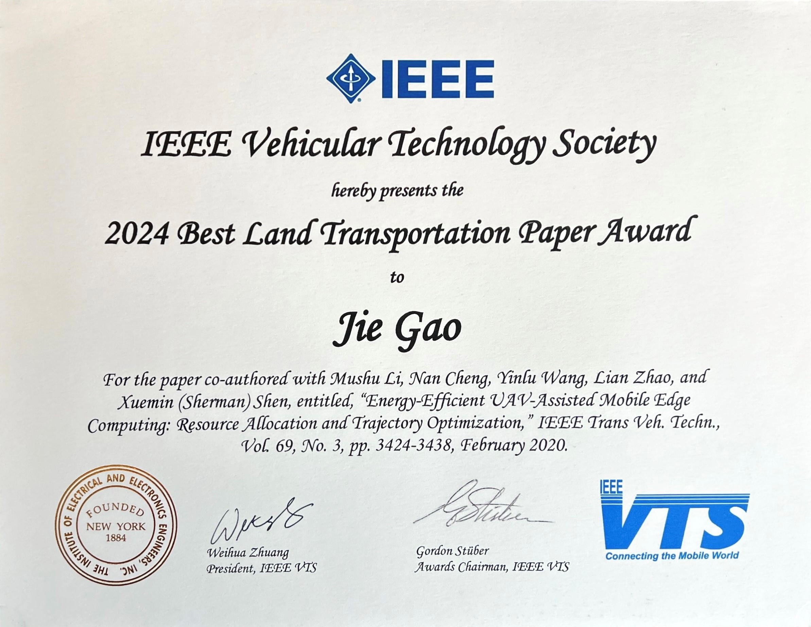
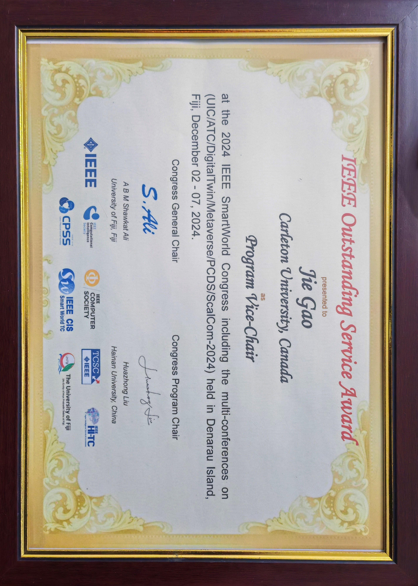
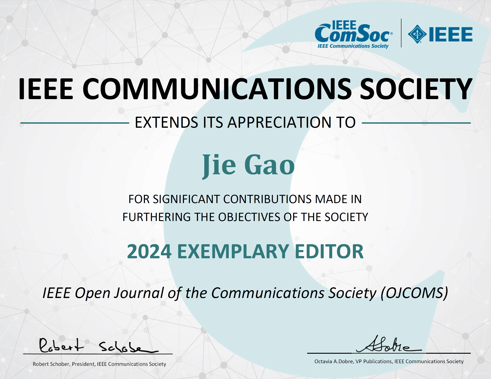

Short Bio
======
Jie Gao received his Ph.D. degree in electrical and computer engineering from the University of Alberta, Edmonton, AB, in 2014, supervised by [Prof. Sergiy Vorobyov](https://users.aalto.fi/~vorobys1/) (IEEE Fellow) and [Prof. Hai Jiang](https://www.ece.ualberta.ca/~hai1/) (IEEE Fellow). He was an NSERC postdoctoral fellow with Toronto Metropolitan University, Toronto, ON, from 2017 to 2019, supervised by [Prof. Lian Zhao](https://www.ecb.torontomu.ca/~lzhao/) (IEEE Fellow), a research associate with the University of Waterloo, Waterloo, ON, from 2019 to 2020, supervised by [Prof. Xuemin (Sherman) Shen](https://uwaterloo.ca/scholar/sshen) (Fellow of IEEE, RSC, CAE and EIC) and [Prof. Weihua Zhuang](https://uwaterloo.ca/scholar/wzhuang) (Fellow of IEEE, RSC, CAE and EIC), and an assistant professor with the Department of Electrical and Computer Engineering, Marquette University, Milwaukee, WI, USA, from 2020 to 2022. In July 2022, he joined the School of Information Technology, Carleton University, Ottawa, ON. Dr. Gao’s research interests include machine learning for communications and networking, cloud and multi-access edge computing, Internet of Things (IoT) and industrial IoT solutions, and next-generation (6G) wireless networks in general. 

Dr. Gao is a cross-appointed faculty with the Departmemt of Systems and Computer Engineering, Carleton University, since 2025 and an adjunct faculty with the [Faculty of Computer Science at Dalhousie University](https://www.dal.ca/faculty/computerscience/faculty-staff.html) since 2024.

 

Professional Membership
======
<ul style="list-style-type:disc;">
  <li>Senior Member, IEEE</li>
  <li>Member, IEEE Communication Society</li>
  <li>Member, IEEE Vehicular Technology Society</li>
  <li>Member, IEEE Sensors Council</li>
</ul>

 

Awards and Honors
======

<ul style="list-style-type:disc;">
  <li>IEEE Outstanding Service Award 2024</li>
  <li>IEEE Open Journal of the Communications Society Best Editor Award 2024</li>
  <li>IEEE Best Land Transportation Paper Award 2024 </li>
  <li>Early-Stage Investigator Grant Award - Wisconsin Space Grant Consortium 2021 </li>
  <li>IEEE Transactions on Vehicular Technology Top Reviewer Award 2018 </li>
</ul>

  &nbsp; &nbsp; &nbsp;
    &nbsp;&nbsp;
   &nbsp;&nbsp;
  

 

Open Positions
======
<strong>Graduate positions</strong>: I am looking for highly motivated graduate students to conduct research on 6G, with a special focus on machine learning. Current topics include (but are not limited to)
<ul style="list-style-type:disc;">
  <li> B5G/6G networks</li>
  <li>Machine learning for network security</li>
  <li>Integrated analytical and data-driven approaches to network optimization</li>
</ul>

For details on my research, see [here](https://drjiegao.github.io//research/) 

Preference: 
<ul style="list-style-type:disc;">
  <li>Electrical engineering/computer engineering/computer science/math/physics background</li>
  <li>Solid analytical and mathematical skills</li>
  <li>Knowledge and experience with machine learning would be a bonus</li>
</ul>
If interested, please send the following documents to jie.gao6@carleton.ca
<ul style="list-style-type:disc;">
  <li>Your CV</li>
  <li>Transcripts from your undergraduate and graduate (if applicable) programs</li>
  <li>A sample publication (if applicable) </li>
</ul>
<strong>Undergraduate research assistant positions</strong>: available from time to time. Please email me if interested. 

 

News
======
<ul style="list-style-type:disc;">
 <li> [May 26, 2025]: Luis Santiago joined the team as a Mitacs Globalink Research Intern for Summer 2025 - Welcome! </li>
 <li> [Mar. 2, 2025]: Our magazine paper "User-centric Immersive Communications in 6G: A Data-oriented Framework via Digital Twin" has been accepted by IEEE Wireless Communications. </li>
 <li> [Feb. 19, 2025]: I gave an invited talk on Digital Twin, Edge Intelligence, and Integrated Sensing and Communication to IEEE ComSoC TCCN SIG on AI empowered Internet of Vehicles. </li>
 <li> [Jan. 18, 2025]: I will be serving as a Publicity Co-Chair for IEEE 102nd Vehicular Technology Conference (VTC2025-Fall). </li>
 <li> [Oct. 9, 2024]: Our paper "Energy-efficient UAV-assisted mobile edge computing: Resource allocation and trajectory optimization" received the IEEE Best Land Transportation Paper Award at the 100th IEEE VTC (VTC-Fall 2024). </li>
 <li> [Aug. 12, 2024]: Our paper "On-Demand Collaborative Sensing with Digital Twin-Driven Resource Allocation," has been accepted by the IEEE VTC-Fall 2024. </li>
<!--
 <li> [Aug. 5, 2024]: Our paper "Digital Twin-Empowered Resource Allocation for On-Demand Collaborative Sensing," has been accepted by the IEEE Internet of Things Journal. </li>
-->
<!--
 <li> [June 16, 2024]: Our paper "User-centric Service Provision for Edge-assisted Mobile AR: A Digital Twin-based Approach," has been accepted by the IEEE/CIC ICCC 2024. </li>
-->
<!--
 <li> [June 16, 2024]: Our paper "Model Drift-Adaptive Resource Reservation in ISAC Networks: A Digital Twin-Based Approach," has been accepted by the IEEE/CIC ICCC 2024. </li>
-->

 
</ul>

